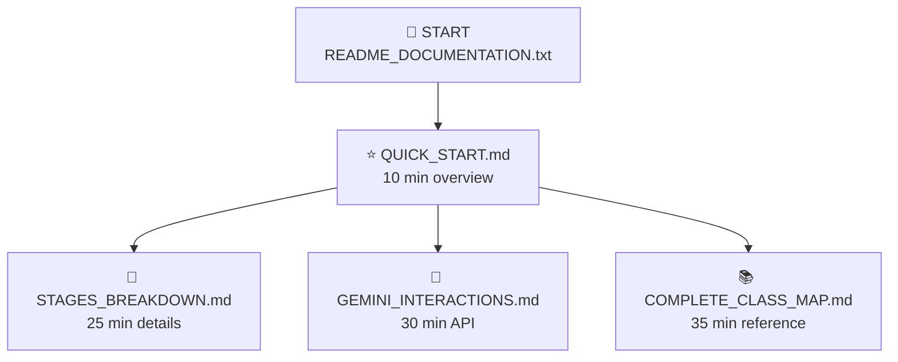

# Documentation Diagrams - Draw.io Import Guide

## Available Diagrams

I've created **2 diagram files** that can be imported into Draw.io:

### 1. **DOCUMENTATION_FLOWCHART.md** (Mermaid Format)
- 7 different Mermaid diagrams
- Shows relationships between documentation files
- Shows reading paths by use case
- Shows content coverage matrix
- Shows topic coverage by document
- Shows quick navigation tree
- Shows recommended reading order

### 2. **documentation_structure.xml** (Draw.io Native Format)
- Direct Draw.io XML file
- Ready to import without conversion
- Shows overall documentation structure
- Shows stage coverage
- Shows common use cases
- Shows documentation stats

---

## How to Import Diagrams to Draw.io

### Option 1: Import Mermaid Diagrams (via DOCUMENTATION_FLOWCHART.md)

**Step 1: Copy Mermaid Code**
```bash
# Open DOCUMENTATION_FLOWCHART.md
# Copy any mermaid diagram code (between ```mermaid and ```)
```

**Step 2: Create Mermaid Shape in Draw.io**
```
1. Go to https://app.diagrams.net/
2. Create a new blank diagram
3. Click "More Shapes" button (bottom-left)
4. Search for "Mermaid" and enable it
5. Drag "Mermaid" shape onto canvas
```

**Step 3: Insert Code**
```
1. Double-click the Mermaid shape
2. Paste your copied mermaid code
3. Click "Apply"
4. Diagram renders automatically
```

**Step 4: Format & Export**
```
1. Resize and position as needed
2. File → Export as → PNG/SVG/PDF
```

---

### Option 2: Import XML Directly (documentation_structure.xml)

**Step 1: Open Draw.io**
```
1. Go to https://app.diagrams.net/
2. Click "File" → "Open"
3. OR: Start new diagram first
```

**Step 2: Import XML File**
```
1. Click "File" → "Import from" → "Device"
2. Select "documentation_structure.xml"
3. Click "Import"
```

**Step 3: View & Edit**
```
1. Diagram opens ready to view
2. Drag elements to rearrange
3. Double-click to edit
4. Right-click for format options
```

**Step 4: Save & Export**
```
1. File → Save (stores to Draw.io)
2. File → Export as → PNG/SVG/PDF
```

---

### Option 3: Quick Copy-Paste (Easiest)

**For Mermaid Diagrams:**

1. Go to https://app.diagrams.net/
2. Click "File" → "New" → "Blank Diagram"
3. Copy this and paste in the diagram editor:
   ```
   Create a mermaid shape, paste code
   ```
4. Click Apply

**For XML Diagram:**

1. Go to https://app.diagrams.net/
2. Right-click canvas → "Edit Data"
3. Paste XML content
4. Done

---

## Mermaid Diagrams Available

### 1. **Main Documentation Structure** (Most Important)
Shows:
- Entry point (README_DOCUMENTATION.txt)
- Reading flow to QUICK_START.md
- Branches to specific docs based on need
- All documents color-coded

**Best for:** Understanding which doc to read first

**Copy from:** DOCUMENTATION_FLOWCHART.md - First diagram (after "## Mermaid Diagram for Draw.io Import")

---

### 2. **Reading Paths by Use Case**
Shows:
- 5 different user personas (New Dev, Debugging, Modifying, API Integration, Data Flow)
- Reading sequence for each persona
- Flow paths unique to each use case

**Best for:** Finding your specific reading path

**Copy from:** DOCUMENTATION_FLOWCHART.md - Second diagram (after "## Reading Paths by Use Case")

---

### 3. **Content Coverage Matrix**
Shows:
- 7 Pipeline Stages on left
- 7 Documentation Topics on top
- 5 Documentation Files on right
- Relationships between all three

**Best for:** Understanding what each doc covers

**Copy from:** DOCUMENTATION_FLOWCHART.md - Third diagram (after "## Content Coverage Matrix")

---

### 4. **Document Dependency Graph**
Shows:
- All 6 documentation files
- How they reference each other
- Connection to source code, output files, logs

**Best for:** Understanding document relationships

**Copy from:** DOCUMENTATION_FLOWCHART.md - Fourth diagram (after "## Document Dependency Graph")

---

### 5. **Topic Coverage by Document**
Shows:
- Each document as a subgraph
- Topics covered in each doc
- 6 key areas per document

**Best for:** Detailed topic lookup

**Copy from:** DOCUMENTATION_FLOWCHART.md - Fifth diagram (after "## Topic Coverage by Document")

---

### 6. **Integration with Codebase**
Shows:
- Documentation layer
- Source code layer
- Output files layer
- Logs layer
- How they all connect

**Best for:** Understanding doc-code-output relationship

**Copy from:** DOCUMENTATION_FLOWCHART.md - Sixth diagram (after "## Integration with Codebase")

---

### 7. **Quick Navigation Tree**
Shows:
- All 6 documents with file sizes
- 5 use cases branching out
- Dependencies (dotted lines)

**Best for:** Quick visual reference

**Copy from:** DOCUMENTATION_FLOWCHART.md - Seventh diagram (after "## Quick Navigation Tree")

---

### 8. **File Structure Visualization**
Shows:
- Root directory structure
- Source code files
- Documentation files (marked with ✅)
- Generated output files

**Best for:** Understanding project organization

**Copy from:** DOCUMENTATION_FLOWCHART.md - Last diagram (after "## File Structure Visualization")

---

### 9. **Recommended Reading Order**
Shows:
- Decision tree for reading order
- Different paths based on experience
- All documents connected
- Final outcome: "Ready to Code!"

**Best for:** Step-by-step guidance

**Copy from:** DOCUMENTATION_FLOWCHART.md - Final diagram (after "## Recommended Reading Order")

---

## XML File Details

### What's in documentation_structure.xml:

**Sections:**
1. **Header** - Title and description
2. **Documentation Files** (6 boxes)
   - README_DOCUMENTATION.txt (Red)
   - QUICK_START.md (Blue)
   - STAGES_BREAKDOWN.md (Green)
   - GEMINI_INTERACTIONS.md (Purple)
   - COMPLETE_CLASS_MAP.md (Yellow)
   - DOCUMENTATION_INDEX.md (Light Blue)
3. **Stage Coverage** (4 sections)
   - Stage 0
   - Stages 1-3
   - Stages 4-6
   - Support Classes
4. **Use Cases** (5 boxes)
   - New to Codebase
   - Debugging Issue
   - Gemini Integration
   - Modify Code
   - Data Flow
5. **Statistics** (6 metrics)
   - Total files
   - Total size
   - Read time
   - Coverage
   - API calls
   - Parallel workers

**Colors:**
- Red: Entry point
- Blue: Main docs
- Green: Details
- Purple: API
- Yellow: Reference
- Light Blue: Navigation

---

## Browser-Based Alternatives

If you don't want to install Draw.io:

### Option A: Mermaid Live Editor
1. Go to https://mermaid.live/
2. Paste any Mermaid code
3. See real-time rendering
4. Export as PNG/SVG

### Option B: GitHub (Free)
1. Create .md file in GitHub repo
2. Mermaid renders automatically
3. No extra tools needed

### Option C: Google Drive
1. Create Drawing in Google Drive
2. Use "Insert" → "Diagram"
3. Import XML as shape

---

## Customization

### If you want to modify the diagrams:

**Mermaid Diagrams:**
1. Edit the mermaid code in DOCUMENTATION_FLOWCHART.md
2. Re-import to Draw.io
3. Changes appear automatically

**XML Diagram:**
1. Open documentation_structure.xml in text editor
2. Modify x/y coordinates for position
3. Modify color codes (hex values)
4. Re-import to Draw.io

---

## Size & Complexity

| Diagram | Complexity | Best For |
|---------|-----------|----------|
| Main Structure | Simple | Beginners |
| Reading Paths | Medium | Persona-based |
| Content Matrix | Complex | Coverage analysis |
| Dependency | Complex | Relationships |
| Topic Coverage | Very Complex | Detailed lookup |
| Integration | Medium | System view |
| Navigation Tree | Medium | Visual navigation |
| File Structure | Simple | Project organization |
| Reading Order | Medium | Step-by-step |

---

## Quick Start Example

### Import First Diagram (Recommended)

**Via Browser:**
1. Open https://mermaid.live/
2. Paste this code:

3. See diagram render
4. Export to PNG

---

## Tips for Best Results

1. **Use Light Theme** - Colors show better
2. **Zoom to 100%** - Better readability
3. **Export as PNG** - Preserves colors
4. **Keep Aspect Ratio** - Don't squeeze
5. **Use Comments** - Add notes in Draw.io

---

## Troubleshooting

**Problem: Mermaid shape not showing in Draw.io**
- Solution: Click "More Shapes" → Search "Mermaid" → Enable

**Problem: XML won't import**
- Solution: Use "File → Open" instead of "File → Import from"

**Problem: Colors look wrong**
- Solution: Check Draw.io theme (Light/Dark) settings

**Problem: Text too small to read**
- Solution: Increase font size in Mermaid code or XML

**Problem: Diagram too large**
- Solution: Use View → Zoom to Fit

---

## File Locations

```
/home/hutech/Documents/docupolicy/

Documentation Files:
├── QUICK_START.md                          ✅ Read first
├── STAGES_BREAKDOWN.md                     ✅ For details
├── GEMINI_INTERACTIONS.md                  ✅ For API
├── COMPLETE_CLASS_MAP.md                   ✅ For reference
├── DOCUMENTATION_INDEX.md                  ✅ For navigation
└── README_DOCUMENTATION.txt                ✅ Welcome guide

Diagram Files:
├── DOCUMENTATION_FLOWCHART.md              ✅ 9 Mermaid diagrams
└── documentation_structure.xml             ✅ Draw.io format

This Guide:
└── DIAGRAMS_GUIDE.md                       👈 You are here
```

---

## Next Steps

1. **Open DOCUMENTATION_FLOWCHART.md**
   - Copy first Mermaid diagram code

2. **Go to https://app.diagrams.net/**
   - Create new diagram
   - Add Mermaid shape
   - Paste code

3. **View the rendering**
   - Understand documentation structure
   - Choose your reading path

4. **Read appropriate documentation**
   - Start with QUICK_START.md
   - Branch to other docs as needed

---

## Export Options

**From Draw.io:**
- PNG - Best for presentations
- SVG - Best for web/editing
- PDF - Best for printing
- HTML - Best for embedding

**From Mermaid.live:**
- PNG - Download directly
- SVG - Vector format
- Markdown - Save code

---

## Questions?

Refer to specific documentation file based on your need:
- **Structure?** → DOCUMENTATION_INDEX.md
- **Content?** → README_DOCUMENTATION.txt
- **Quick overview?** → QUICK_START.md
- **Details?** → Specific stage doc
- **Navigation?** → DOCUMENTATION_INDEX.md

---

**Happy diagramming! 🎨**
