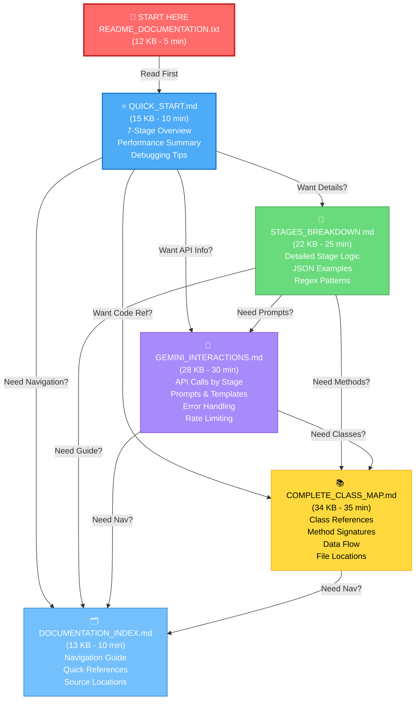
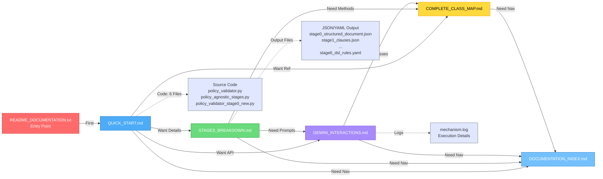
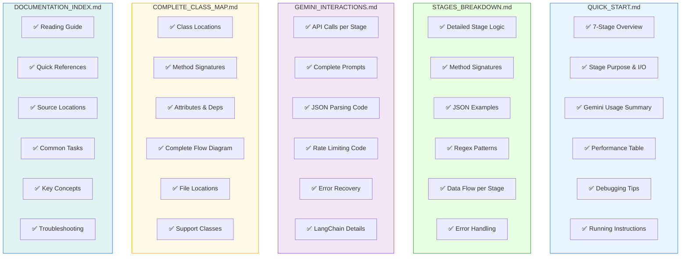
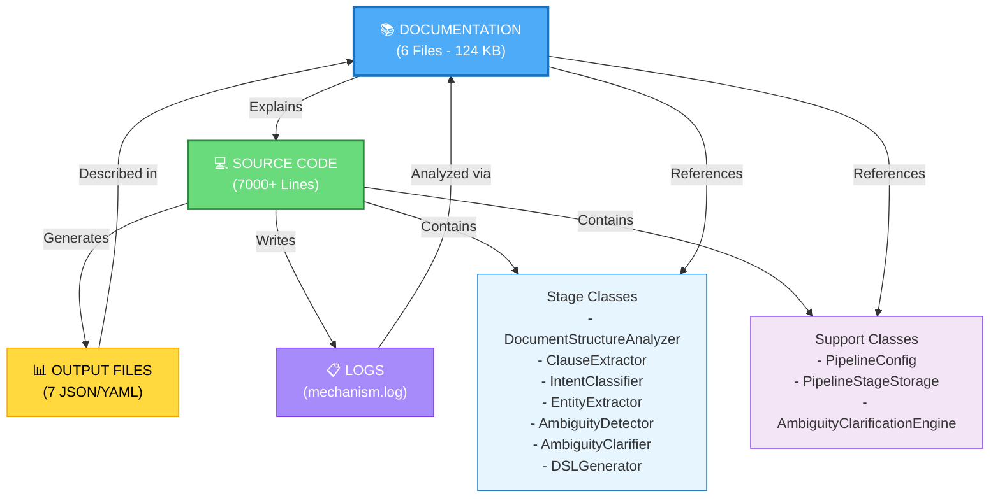
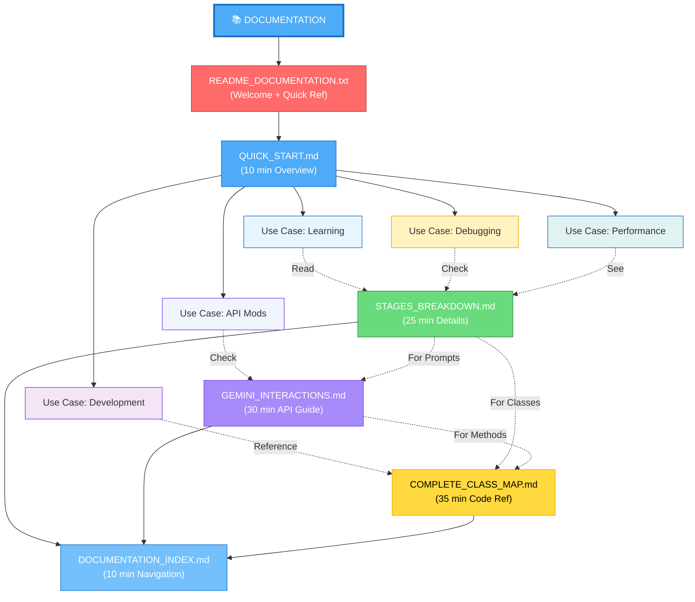
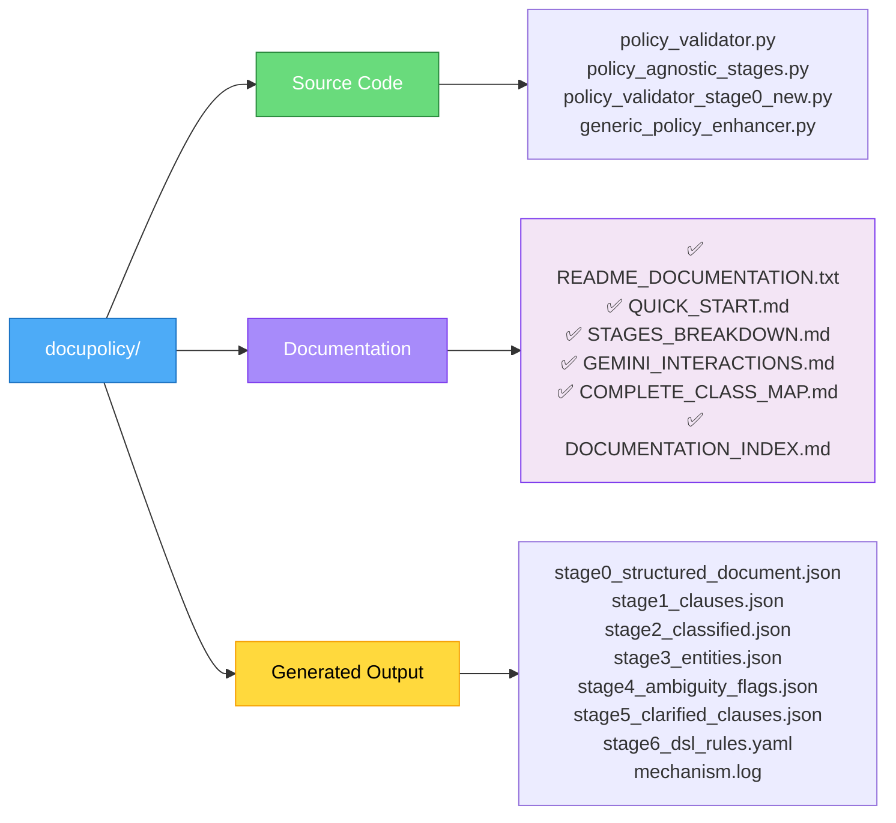
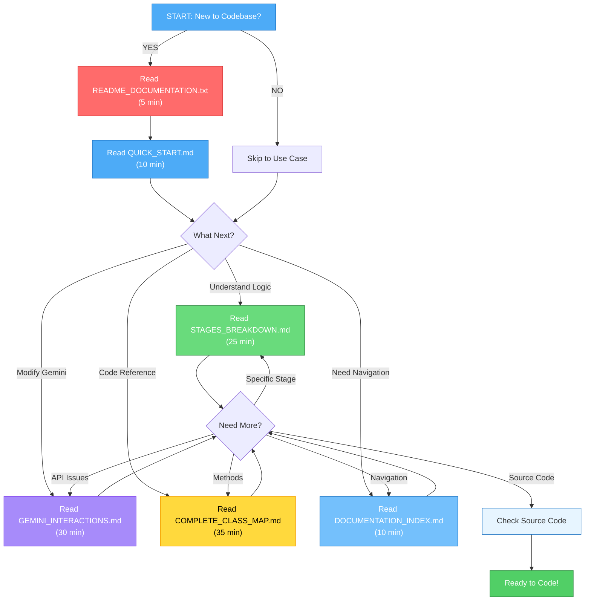

# Documentation Structure Diagram (Draw.io Compatible)

## Mermaid Diagram for Draw.io Import

---

## Reading Paths by Use Case

```mermaid
graph LR
    subgraph NewDev["🆕 NEW TO CODEBASE"]
        N1["README_DOCUMENTATION.txt"]
        N2["QUICK_START.md"]
        N3["STAGES_BREAKDOWN.md"]
        N4["(Source Code)"]
    end
    
    subgraph DebugDev["🐛 DEBUGGING ISSUE"]
        D1["QUICK_START.md<br/>Quick Debugging"]
        D2["mechanism.log"]
        D3["STAGES_BREAKDOWN.md<br/>Specific Stage"]
        D4["COMPLETE_CLASS_MAP.md<br/>Methods"]
    end
    
    subgraph ModifyDev["✏️ MODIFY CODE"]
        M1["COMPLETE_CLASS_MAP.md<br/>Class/Stage"]
        M2["GEMINI_INTERACTIONS.md<br/>If Uses Gemini"]
        M3["Source Code"]
        M4["mechanism.log"]
    end
    
    subgraph APIIntDev["🔌 GEMINI INTEGRATION"]
        A1["GEMINI_INTERACTIONS.md"]
        A2["Specific Stage Section"]
        A3["Prompts & Examples"]
        A4["Error Handling Code"]
    end
    
    subgraph DataFlowDev["🔄 UNDERSTAND DATA FLOW"]
        F1["STAGES_BREAKDOWN.md<br/>Stage-by-stage"]
        F2["COMPLETE_CLASS_MAP.md<br/>Flow Diagram"]
        F3["Output JSON Files"]
    end
    
    N1 --> N2 --> N3 --> N4
    D1 --> D2 --> D3 --> D4
    M1 --> M2 --> M3 --> M4
    A1 --> A2 --> A3 --> A4
    F1 --> F2 --> F3
    
    style NewDev fill:#e7f5ff
    style DebugDev fill:#fff3bf
    style ModifyDev fill:#f3e5f5
    style APIIntDev fill:#f0f4ff
    style DataFlowDev fill:#e0f2f1
```

---

## Content Coverage Matrix

```mermaid
graph TB
    subgraph Stages["7 PIPELINE STAGES"]
        S0["Stage 0<br/>DocumentStructureAnalyzer"]
        S1B["Stage 1B<br/>ClauseExtractor"]
        S2["Stage 2<br/>IntentClassifier"]
        S3["Stage 3<br/>GenericEntityExtractor"]
        S4["Stage 4<br/>GenericAmbiguityDetector"]
        S5["Stage 5<br/>AmbiguityClarifier"]
        S6["Stage 6<br/>DSLGenerator"]
    end
    
    subgraph Topics["DOCUMENTATION TOPICS"]
        T1["Gemini API Usage"]
        T2["Prompts & Templates"]
        T3["Error Handling"]
        T4["Methods & Signatures"]
        T5["Data Flow"]
        T6["Performance"]
        T7["Configuration"]
    end
    
    subgraph Files["DOCUMENTATION FILES"]
        F1["QUICK_START.md"]
        F2["STAGES_BREAKDOWN.md"]
        F3["GEMINI_INTERACTIONS.md"]
        F4["COMPLETE_CLASS_MAP.md"]
        F5["DOCUMENTATION_INDEX.md"]
    end
    
    S0 -.->|Covered in| F1
    S1B -.->|Covered in| F1
    S2 -.->|Covered in| F1
    S3 -.->|Covered in| F1
    S4 -.->|Covered in| F1
    S5 -.->|Covered in| F1
    S6 -.->|Covered in| F1
    
    T1 -.->|In| F3
    T2 -.->|In| F3
    T3 -.->|In| F3
    T4 -.->|In| F4
    T5 -.->|In| F2
    T6 -.->|In| F1
    T7 -.->|In| F5
    
    style Stages fill:#e7f5ff
    style Topics fill:#f3e5f5
    style Files fill:#fff3bf
```

---

## Document Dependency Graph

---

## Topic Coverage by Document

---

## Integration with Codebase

---

## Quick Navigation Tree

---

## How to Import to Draw.io

### Method 1: Copy Mermaid Code
1. Go to https://app.diagrams.net/
2. Create new diagram
3. Click `More Shapes` → Search for `Mermaid`
4. Add Mermaid shape to canvas
5. Double-click and paste the mermaid code above
6. Click Apply

### Method 2: Use Mermaid Live Editor
1. Go to https://mermaid.live/
2. Paste any Mermaid code from above
3. Click "Copy SVG" or "Export as PNG"
4. Import into Draw.io

### Method 3: Direct Import
1. Go to https://app.diagrams.net/
2. Click `File` → `Import from` → `URL`
3. Use Mermaid diagram URL

---

## File Structure Visualization

---

## Recommended Reading Order

